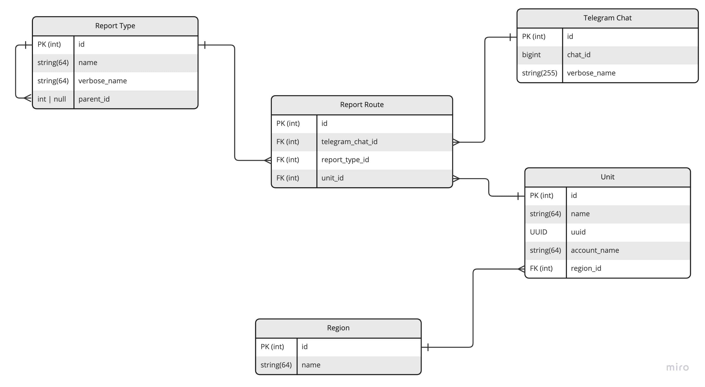

# Unit's routes Database

Сервис хранит информацию о всех подключенных юнитах, 
а также информацию о маршрутах отчетов/уведомлений.

---

### Терминология:
- Unit - точка продаж/пиццерия.
- Chat ID - уникальный идентификатор чата в Telegram.
- Маршрут - связка chat ID, юнита и типа отчета.

---

#### Схема таблиц в БД:


---

### Зависимости:
- fastapi + uvicorn
- sqlalchemy + psycopg2
- python-dotenv
- БД Postgresql

---

### Конфигурация:
Создайте файл `.env` в корне проекта.
Необходимы следующие переменные окружения:
- APP_HOST - хост приложения. Обычно `127.0.0.1`.
- APP_PORT - порт приложения.
- DEBUG - режим отладки, `true`/`false`.
- DATABASE_URL - URL БД Postgres'а. 

---

### Установка и запуск:
Создание виртуального окружения:
```shell
poetry env use python3.11
```

Активация виртуального окружения:
```shell
poetry shell
```

Установка зависимостей:
```shell
poetry install --without dev
```

Запуск можно произвести двумя путями:
```shell
python src/main.py
```
или
```shell
# в директории src
uvicorn main:app --host=Ваш хост --port=Ваш порт
```
